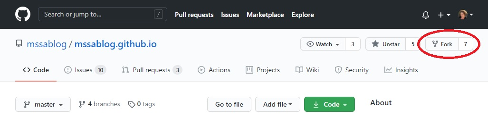
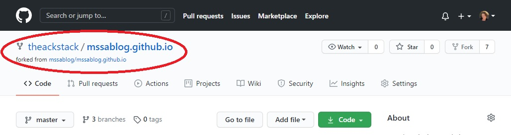
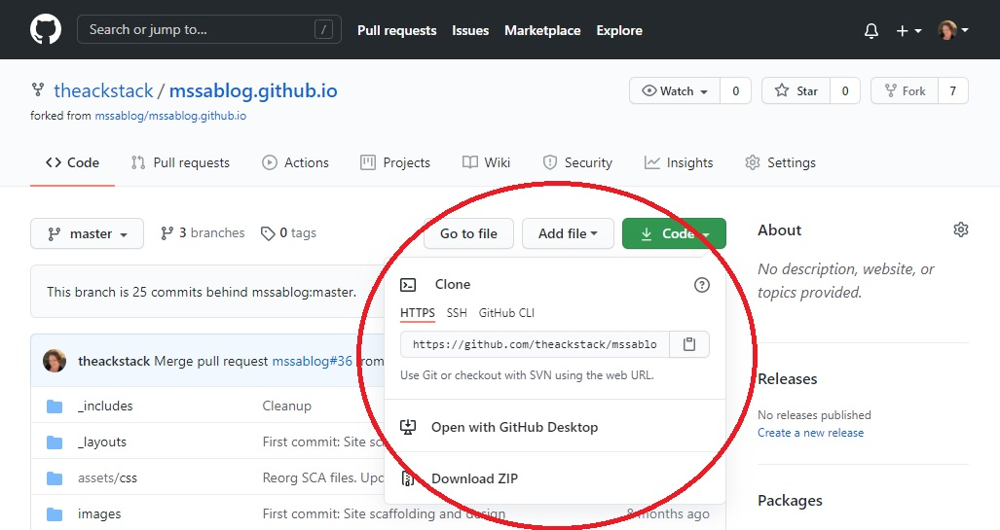

## Guide to Contributing

### Introduction

The MSSA Blog site is split into two main sections:
* My personal blog located at [https://mssablog.com](https://mssablog.com), which focuses primarily on opinion-based topics, and
* This open-source site for soft skills and technical resources, hosted as a public GitHub repository at [https://github.com/mssablog/mssablog.github.io](https://github.com/mssablog/mssablog.github.io).

This doc focuses on contributions to the open-source site in the form of adding resources, fixing bugs, and making improvements to the site itself.  For more information on other ways to help out with the MSSA Blog project, check out [this page](https://mssablog.com/contribute/).

### What to Contribute

Useful contributions to this repository come in a variety of forms.  The following are a few ideas for what to work on:

* **Add a resource to a page.**  These simple but highly impactful contributions require little or no coding knowledge, although an understanding of [markdown syntax](https://guides.github.com/features/mastering-markdown/) is helpful.  Simply choose the page you'd like to add to, and use the pre-existing template as a guide to make your changes and include the resources and links that you'd like to share with other students.

* **Help out with known issues and feature requests.**  Check out the [issues list](https://github.com/mssablog/mssablog.github.io/issues) for the mssablog repository.  This grab bag of bugs and features is a great place to start if you're looking for something specific to work on.  Choose a work item that matches your ability level and interests, and give it a shot!

* **Contribute your own ideas and suggestions.**  As you're browsing the site, if you have recommendations for improvements or new features, you can either [file a new issue](https://github.com/mssablog/mssablog.github.io/issues) as an opportunity for someone else to gain experience, or feel free to create a new branch and build/fix the feature yourself!

Ready to help out?  Read on!

### How to Contribute

This section serves as a high-level overview of the expected workflow for the [mssablog](https://github.com/mssablog/mssablog.github.io) repository, and is not intended as a full guide to source control or Git.  If you need assistance with any of the following steps, instructions for most of these topics can easily be found online.  You can also seek guidance from your mentors or other developers, who are usually happy to help!

#### What You'll Need

In order to add to the open source section of the MSSA Blog site, you'll need the following:
* GitHub account
* Basic understanding of source control and contributing to open-source projects
* Git tool/client of your choice (such as [Git Bash](https://git-scm.com/), [GitHub Desktop](https://desktop.github.com/), or similar
* Depending on the nature of the changes you're making, some coding knowledge may be required

#### Contribution Workflow

This repository uses a "fork and branch" workflow.  The explanation below is tailored to MSSA students who are new to GitHub and open-source contributions.

For more information on forking workflows, check out these docs:
* [GitHub Guides - Forking Projects](https://guides.github.com/activities/forking/)
* [Atlassian Tutorials - Forking Workflow](https://www.atlassian.com/git/tutorials/comparing-workflows/forking-workflow)

The following instructions use Git Bash for examples, but there are a variety of ways to complete these steps depending on which Git tools you're using.  If you're unsure how to complete a step, look up online documentation for your tools of choice or ask another developer for help.

#### Fork the Repository

Sign in to your GitHub account.

Fork the repository located at [https://github.com/mssablog/mssablog.github.io](https://github.com/mssablog/mssablog.github.io) using the button located in the upper right corner:



Once the process completes, GitHub should automatically redirect you to the newly created fork in your GitHub account. Check the repository name in the upper left corner to verify:



#### Clone the Repository

Create a local clone (copy) of your forked repository.

First, choose a location on your computer where you want to create a local clone, or copy, of the repository.  Many people have a dedicated `repos/` directory, but you can clone anywhere you'd like as long as it's a location you are able to access using your Git tools.

To create the clone, you'll need the remote URL to your fork.  This URL can be found by clicking the green "Code" button at the top of your forked repository's main page:



Click the clipboard icon to the right of the URL to copy it.

*Note: For help deciding whether to clone using HTTPS or SSH, see the following GitHub Docs page: [Which remote URL should I use?](https://docs.github.com/en/github/using-git/which-remote-url-should-i-use)*

In the next step, you'll create a local clone (or copy) of the repository that's connected to the fork you created in your GitHub account.

Using Git Bash, navigate to the directory where you'd like to create the clone:

```
cd repos
```

Create the clone using the following command:

```
git clone https://github.com/<your-GitHub-username>/mssablog.github.io.git
```

#### Create a New Branch

Branches in Git act as workspaces where you can make changes without affecting the main, or "master" version of the code.  Developers typically create a new branch for each separate work item, such as an issue, bugfix, or new feature.

Note: For contributions to this repository, please name branches using the following convention: `users/<your-GitHub-username>/<branch-name>`.

Using Git Bash, navigate into the directory for the repository:

```
cd mssablog.github.io
```

Create a new branch using the following command:

```
git branch <branch-name>
```

Next, you'll check out the new branch you created in order to switch to that "workspace" for your changes:

```
git checkout <branch-name>
```

Note: Git also has a convenient feature where you can create a new branch and check it out at the same time in one step:

```
git checkout -b <branch-name>
```

#### Make Changes and View Status

You've now got a local copy of the code on your machine, and you've checked out your branch.  Open the codebase (the local copy you created) using the IDE or text editor of your choice.

At any point, you can use your Git tools to view the status of the files you've modified or created.

Using Git Bash, run the `status` command to see an overview of your updates:

```
$ git status
```

The output should look similar to the following:

```
On branch users/<your-GitHub-username>/<branch-name>
Changes not staged for commit:
  (use "git add <file>..." to update what will be committed)
  (use "git checkout -- <file>..." to discard changes in working directory)

        modified:   index.md

Untracked files:
  (use "git add <file>..." to include in what will be committed)

        some-other-file.md

no changes added to commit (use "git add" and/or "git commit -a")

```

IDE's and Git clients often have UI features (such as colors and/or letters) that indicate the status of the files that you've created, modified, or deleted.

#### Commit Changes

Committing your changes creates a record of some meaningful chunk of work that you've done on your branch.  Commits typically include a brief message describing the changes that were made.

To add (or "stage") a file to be included in the commit, use the `git add` command with the filename:

```
git add index.md
```

To create a commit with your changes, use the `git commit` command along with the `-m` option to include a message:

```
git commit -m "Add introduction section to homepage"
```

IDE's and Git clients usually have UI features and menu options for staging/unstaging files and creating commits.

#### Push Changes

In the previous step, you committed changes to your branch, but so far those updates have only been recorded on your local machine.  In order to eventually create a pull request, you'll need to upload your changes to GitHub.

To do this, run the following command in Git Bash to set up a remote branch on GitHub that is tied to your local branch:

```
 git push --set-upstream origin users/<your-GitHub-username>/<branch-name>
```

You only need to run this command once to create the remote branch.  After that, you can push commits to GitHub by simply running:

```
git push
```

#### Create a Pull Request

Once you've completed your changes and are ready to request to merge them into the main repository, you'll ned to create a pull request.

TODO: Complete this section